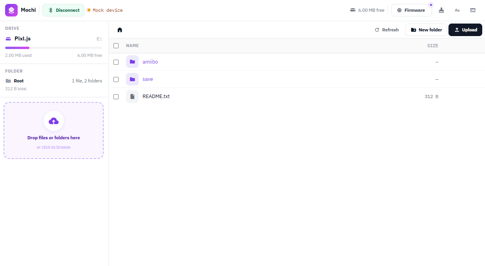

# Mochi

Web Bluetooth workspace for [Pixl.js](https://github.com/solosky/pixl.js) to browse, upload, and manage NFC tag files over BLE from the browser, with no firmware changes needed.

**[Try it](https://tasken.github.io/Mochi/)** (requires a Chromium-based browser: Chrome, Edge, or Brave)



## Features

- **File browser**: navigate folders, rename, delete, and multi-select files on the device
- **Tree uploader**: drop a local folder or files to upload with real-time progress
- **Sync**: diff local and device trees, push changes, and remove orphaned files in the upload tree
- **Normalize**: lowercase-rename files and folders for firmware path compatibility
- **Format**: wipe and reformat the device drive
- **NFC tag lookup**: `.bin` files show character name and series from [AmiiboAPI](https://amiiboapi.org/)
- **Firmware version check**: notified when a newer build is available from the device firmware CI

## Development

To run the app locally for development or contribution:

```bash
# One-time setup
python3 -m venv .venv
source .venv/bin/activate
pip install invoke

# Generate a self-signed cert (one-time)
mkdir -p .cert
openssl req -x509 -newkey rsa:2048 -keyout .cert/key.pem -out .cert/cert.pem \
  -days 365 -nodes -subj "/CN=localhost"

# Start the dev server (HTTPS at localhost:8443)
inv serve
```

For LAN access (e.g. from a phone on the same network):

```bash
inv serve --bind 0.0.0.0 --host <your-local-ip>
```

> Click **Mock device** in the top bar to simulate a connected device without hardware. The button is only visible in local dev mode.

## License

MIT. See [LICENSE](LICENSE).
